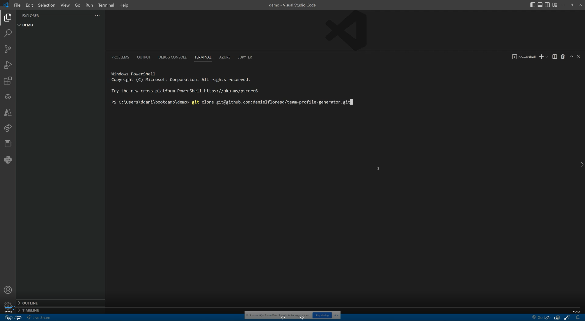
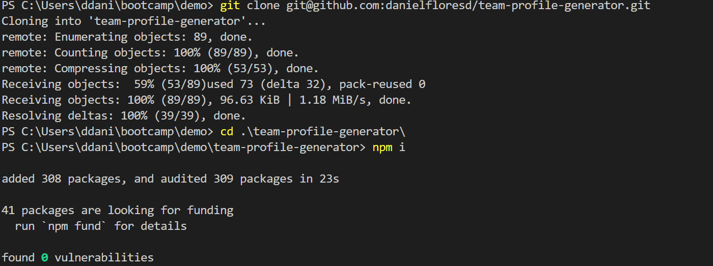
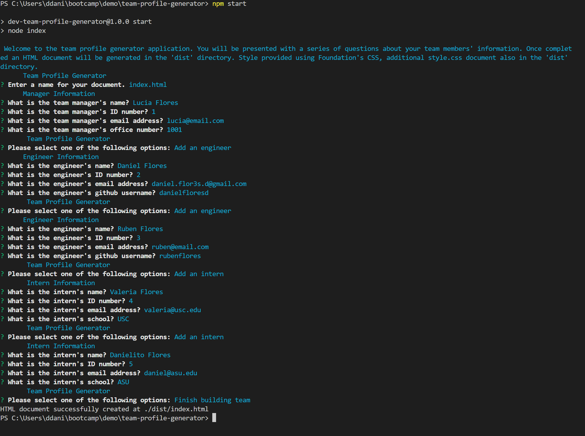
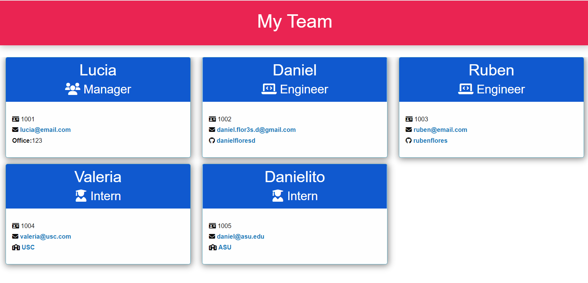
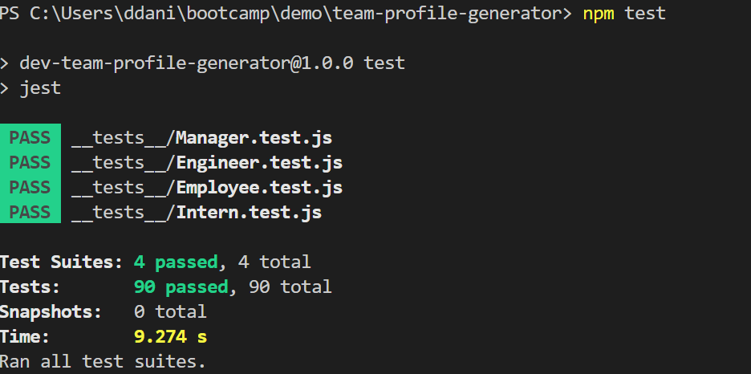

# Team Profile Generator

## Description   

This application will automatically generate a styled HTML file displaying all members of a development team. The application supports roles for Manager, Engineer, and Intern. Each employee will be displayed with his/her name, ID, and email. For Managers an office number should be provided, additionally, for Engineers, a GitHub id should be provided, and for Interns, a school name must be provided.

<strong>🎥Click on video to view🎥</strong>

<a href="https://drive.google.com/file/d/1qTWG7uddcVcrCi7xVT3yNl4vStEt5ZMf/view?usp=share_link" target="_blank">
</img>
</a>

Download Video in <a href="./public/images/video.webm">webm</a> or <a href="./public/images/video.mp4">mp4</a>

## Table of contents

  * [Description](#description)
  * [Installation](#🛠️installation)
  * [Usage](#💻usage)
  * [Dependencies](#🧩dependencies)
  * [License](#📛license)
  * [Contributing](#🤝contributing)
  * [Tests](#📃tests)
  * [Questions](#❓questions)
  * [Website](#🌐website)
  * [Programming Languages](#👨‍💻programming-languages)
  * [Credits](#👨creadits)

## 🛠️Installation    

To install the application clone the repository https://github.com/danielfloresd/team-profile-generator and run node package manager with the following command: <strong>npm i</strong>    

      

## 💻Usage    

After installing all dependencies run <strong>node index.js or npm start</strong>. The application can also be using aby opening index.html with your favorite web browser

  
  

## 🧩Dependencies   
* [Inquirer.js](https://www.npmjs.com/package/inquirer)
* [Jest](https://www.npmjs.com/package/jest)
* [Foundation](https://get.foundation/)

## 📛License    
Project license: [MIT](https://choosealicense.com/licenses/mit).     

<b>View License</b>
MIT License

Copyright (c) 2022 Daniel Flores D

Permission is hereby granted, free of charge, to any person obtaining a copy
of this software and associated documentation files (the "Software"), to deal
in the Software without restriction, including without limitation the rights
to use, copy, modify, merge, publish, distribute, sublicense, and/or sell
copies of the Software, and to permit persons to whom the Software is
furnished to do so, subject to the following conditions:

The above copyright notice and this permission notice shall be included in all
copies or substantial portions of the Software.

THE SOFTWARE IS PROVIDED "AS IS", WITHOUT WARRANTY OF ANY KIND, EXPRESS OR
IMPLIED, INCLUDING BUT NOT LIMITED TO THE WARRANTIES OF MERCHANTABILITY,
FITNESS FOR A PARTICULAR PURPOSE AND NONINFRINGEMENT. IN NO EVENT SHALL THE
AUTHORS OR COPYRIGHT HOLDERS BE LIABLE FOR ANY CLAIM, DAMAGES OR OTHER
LIABILITY, WHETHER IN AN ACTION OF CONTRACT, TORT OR OTHERWISE, ARISING FROM,
OUT OF OR IN CONNECTION WITH THE SOFTWARE OR THE USE OR OTHER DEALINGS IN THE
SOFTWARE.

    
       
## 🤝Contributing 

If you would like to contribute, please follow the [GitHub contribution guidelines](https://github.com/github/docs/blob/main/CONTRIBUTING.md)   
      
## 📃Tests  
Testing implemented using jest. To run unit testing <strong>npm test</strong>

## ❓Questions   

 Question 1: Does the application support additional styling? Yes, the style can be customized in the style.css file.

*    
*     
        
## 🌐Website    
To use the web app, please visit the [Team Profile Generator](https://danielfloresd.github.io/team-profile-generator/)  

## 👨‍💻Programming Languages    
This project was created with: HTML, CSS, and JavaScript   

## 👨Credits
 logger.js used to print colorful messages to console log was borrowed from the University of Arizona bootcamp course material

<!-- <b>User Story</b>
AS A manager
I WANT to generate a webpage that displays my team's basic info
SO THAT I have quick access to their emails and GitHub profiles

<b>Acceptance Criteria</b>
GIVEN a command-line application that accepts user input
WHEN I am prompted for my team members and their information
THEN an HTML file is generated that displays a nicely formatted team roster based on user input
WHEN I click on an email address in the HTML
THEN my default email program opens and populates the TO field of the email with the address
WHEN I click on the GitHub username
THEN that GitHub profile opens in a new tab
WHEN I start the application
THEN I am prompted to enter the team manager’s name, employee ID, email address, and office number
WHEN I enter the team manager’s name, employee ID, email address, and office number
THEN I am presented with a menu with the option to add an engineer or an intern or to finish building my team
WHEN I select the engineer option
THEN I am prompted to enter the engineer’s name, ID, email, and GitHub username, and I am taken back to the menu
WHEN I select the intern option
THEN I am prompted to enter the intern’s name, ID, email, and school, and I am taken back to the menu
WHEN I decide to finish building my team
THEN I exit the application, and the HTML is generated

    -->
      
